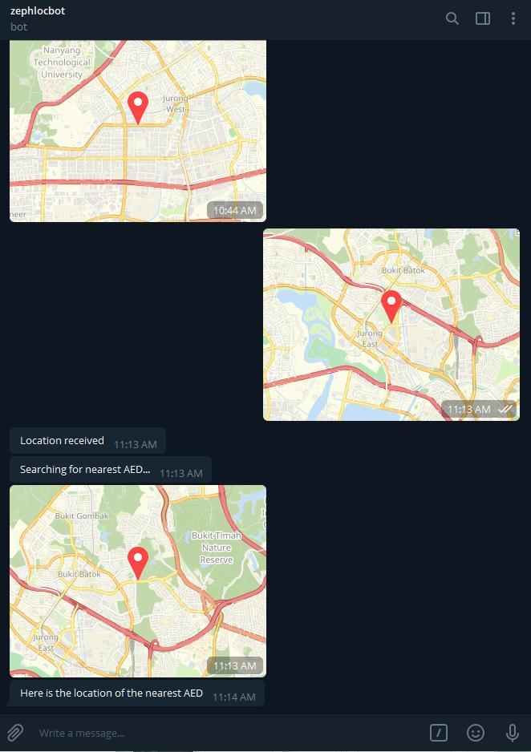

# Find-Nearby-AED
A Telegram bot that will help a user find the nearest AED based on the location sent to the bot.

AED locations are stored in a Firebase Real-Time Database with latitude and logitude. When user sends their location through the Telegram app to the bot, the bot will send back a location to the user and the user can tap on the location for further directions.

